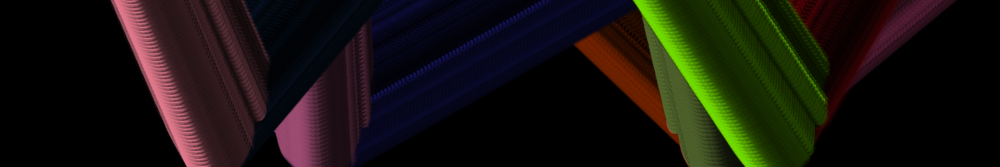

# **The Rich Art Space**
Personal portfolio website and online space of Richard van 't Hof built to show my work and experiments built using [React](https://reactjs.org/) and the [Gatsby static site generator](https://www.gatsbyjs.org/).
-------------

## 📦 Requirements
- Npm/Yarn
- Node JS
- Gatsby

## 🚀 Getting Started  
To edit this site the following steps have to be taken
1. clone this repository
2. Install all packages using this command

**Yarn**
```javascript
yarn install
```

**npm**
```javascript
npm install install
```
3. Run the following command to start the server
```javascript
gatsby develop
```
### 🛠 Building
To build a site for deployment, use the following command
```javascript
gatsby build
```
## Licence
The code in this project will be provided under the MIT Licence with the exeption of assets, concepts and styling that are part of The Rich Art Space brand or it's projects/concepts.
