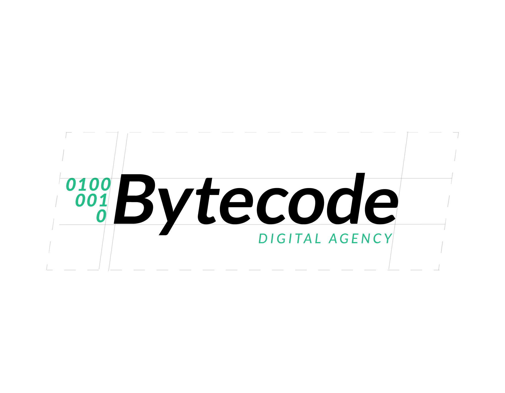
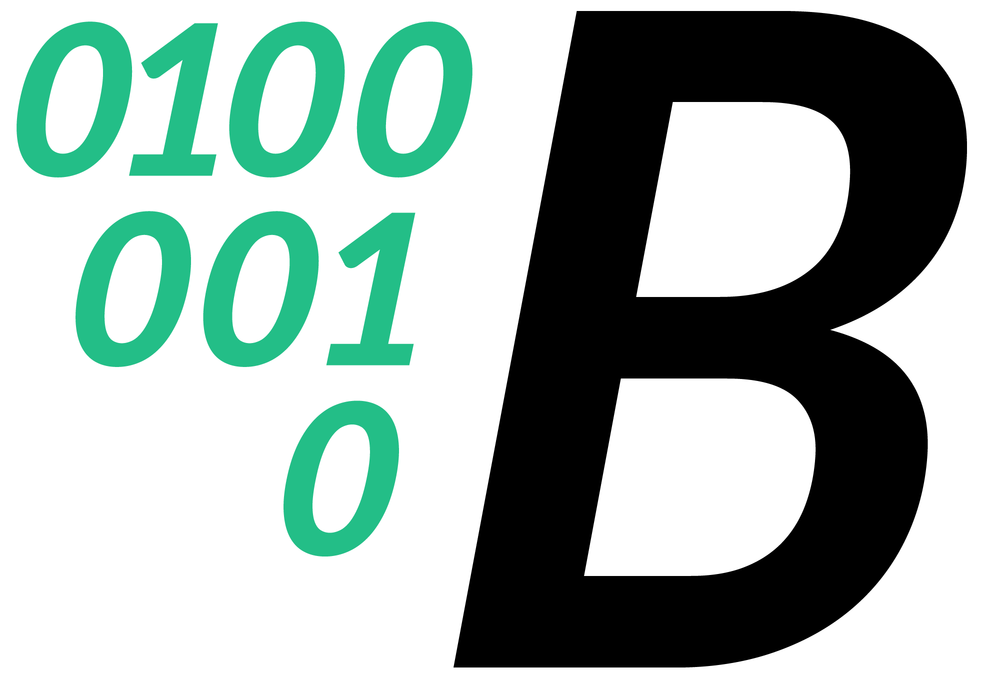
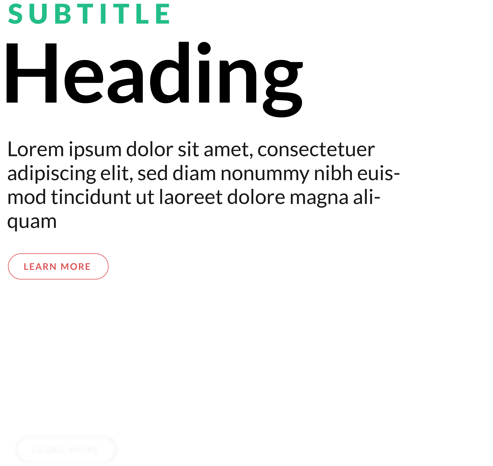
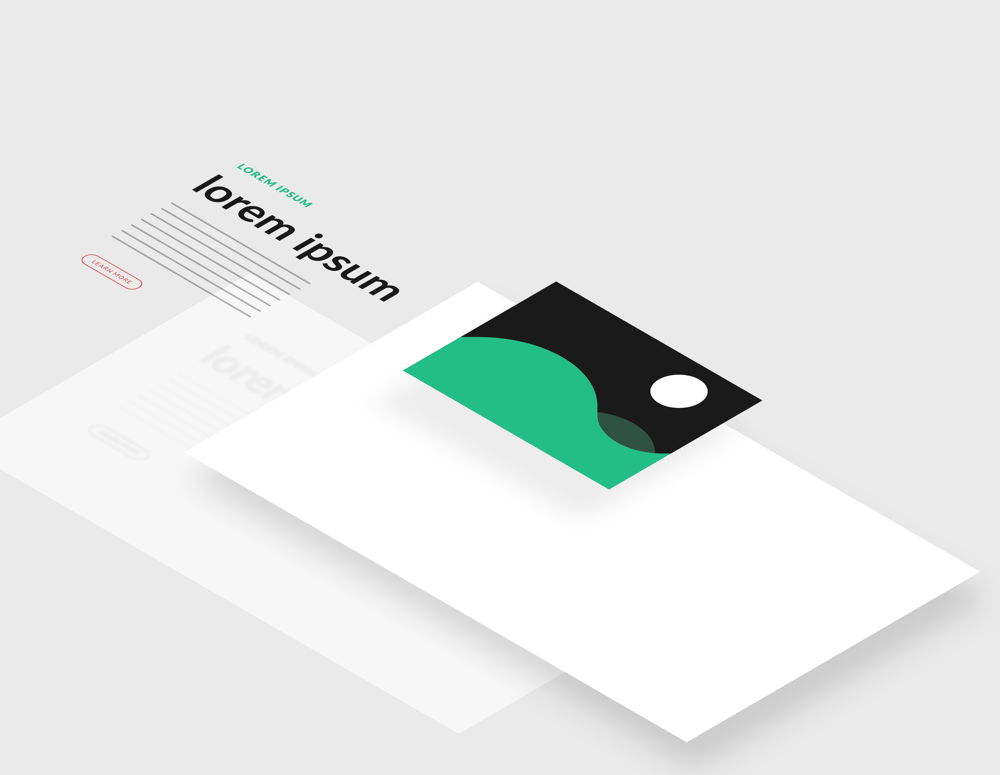
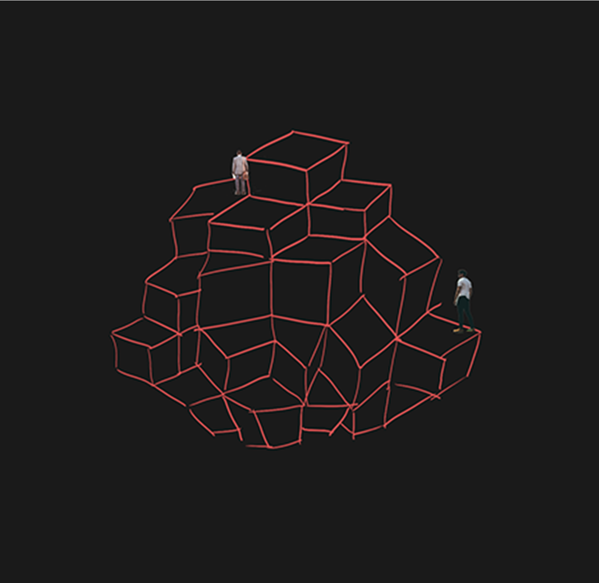
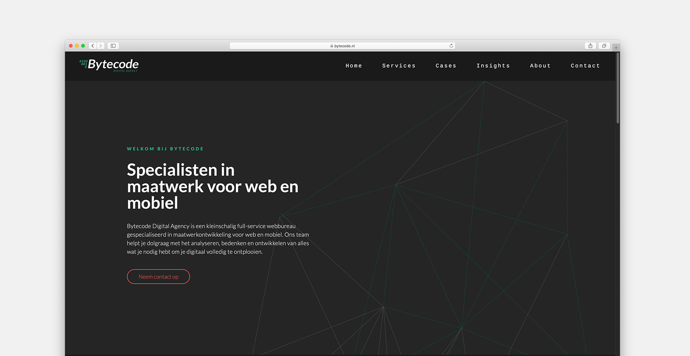
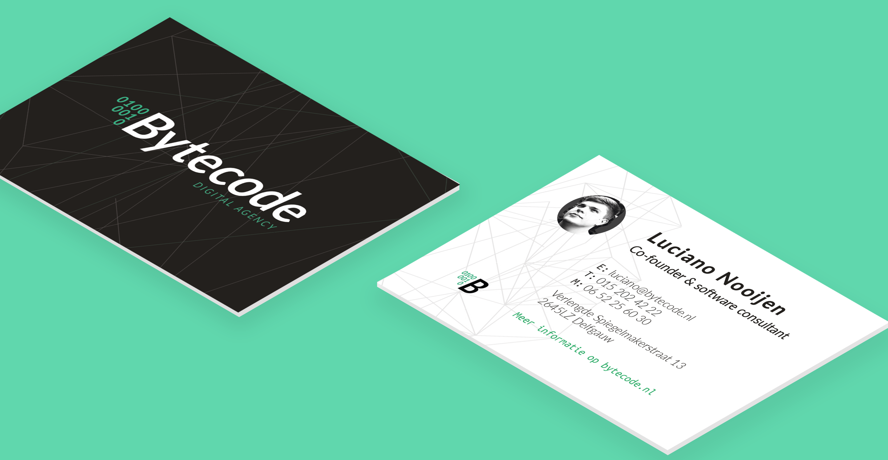

import Gallery from '../../components/gallery.jsx';
import Embed from '../../components/embed.jsx';

<Gallery width={50}>

</Gallery>

<Gallery fluid width={50}>

hello darkness my old friend

</Gallery>

<Gallery fluid width={80}>

</Gallery>

