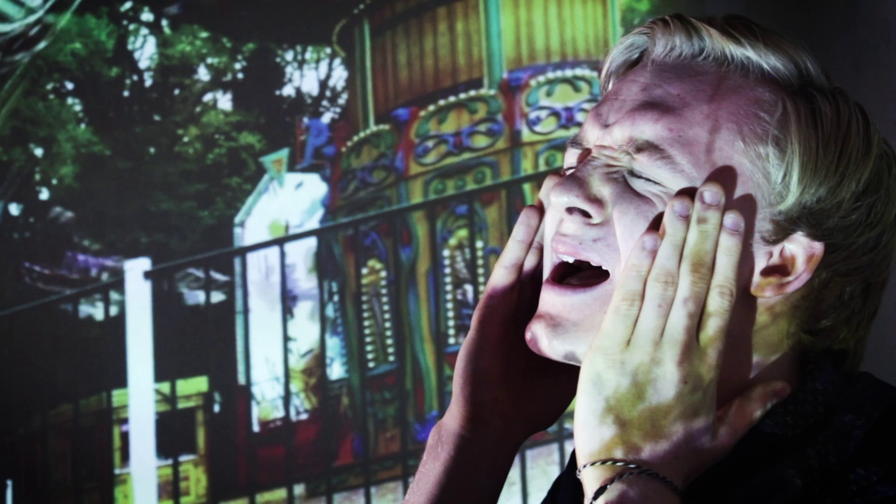
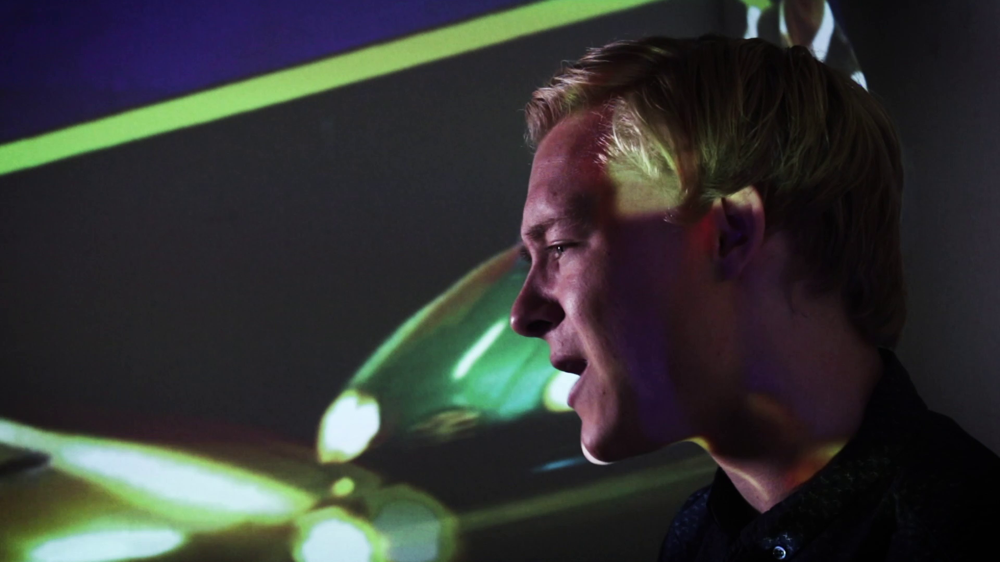
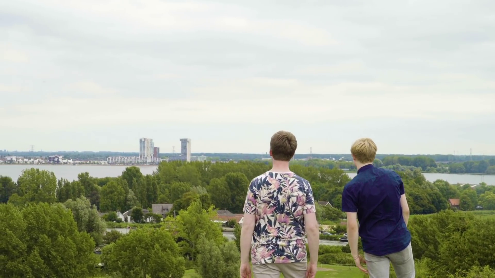
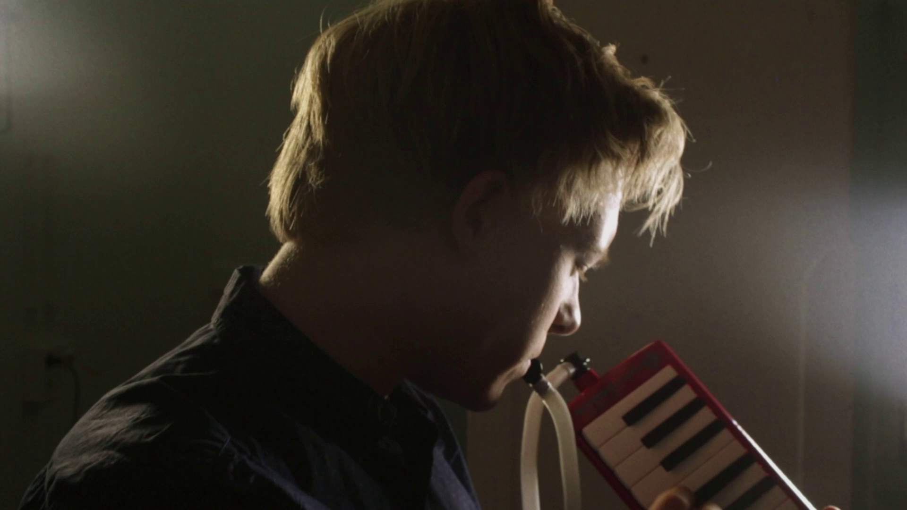
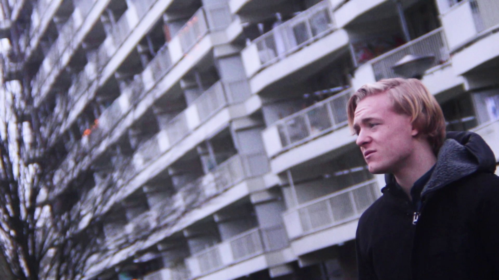

import Gallery from '../../components/gallery.jsx';
import Embed from '../../components/embed.jsx';
import Container from '../../components/container.jsx'

<Gallery width={50}>

</Gallery>

<Container>

## Album art

</Container>

<Gallery width={25}>

</Gallery>

