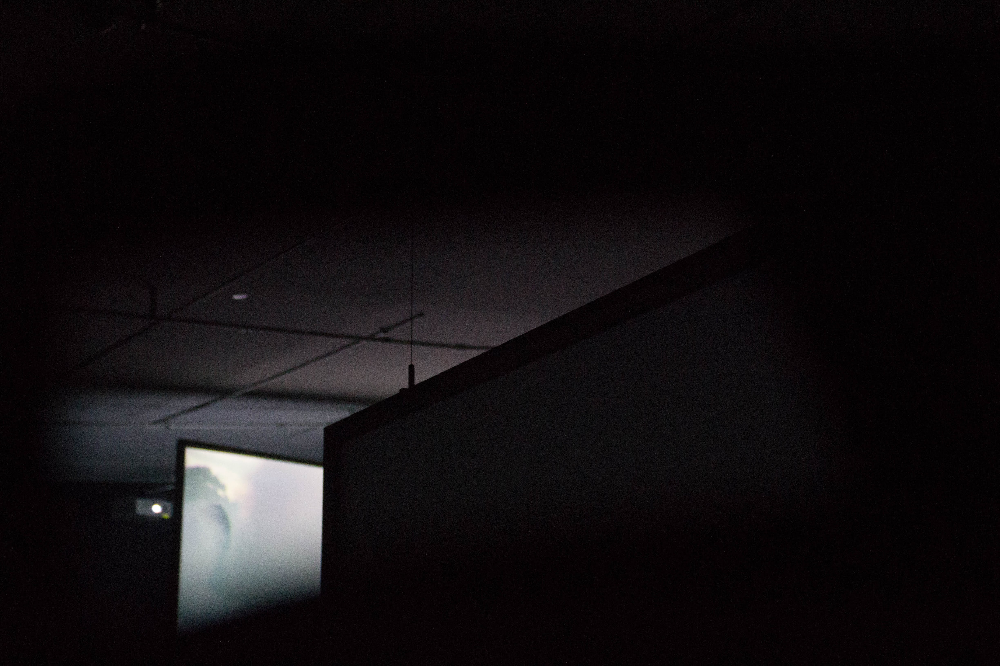
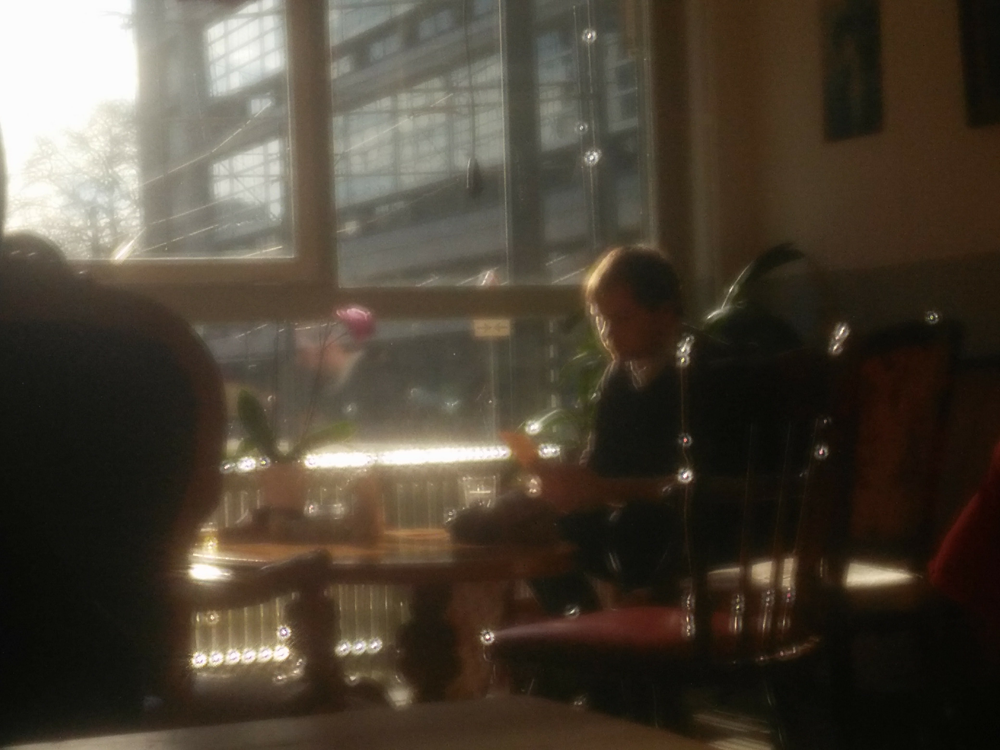
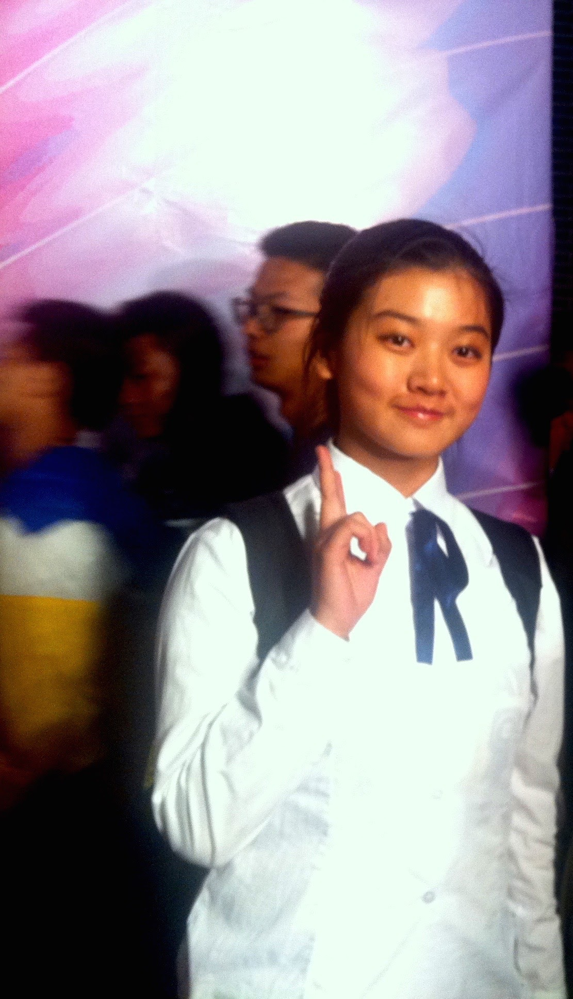
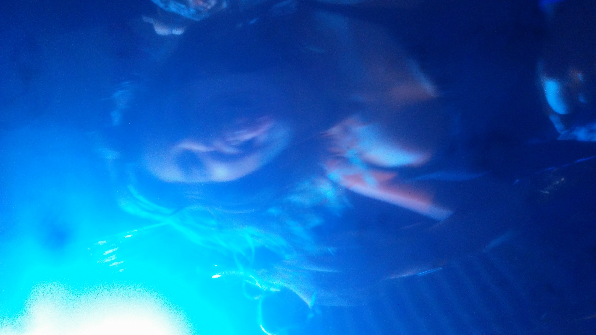
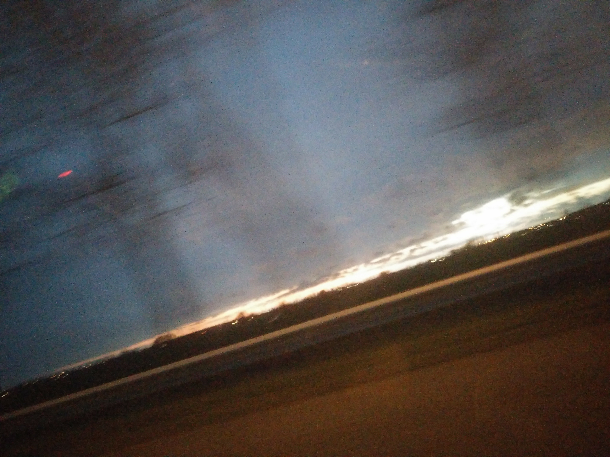
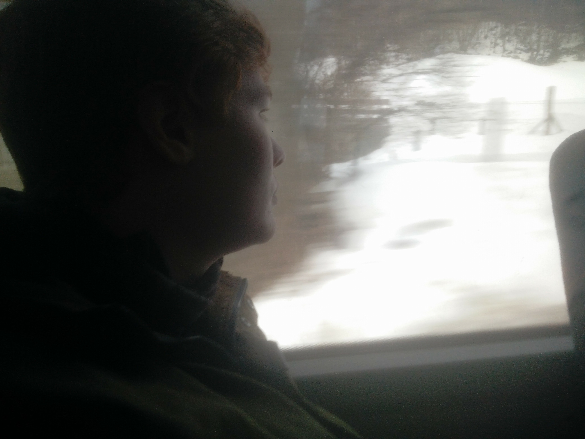
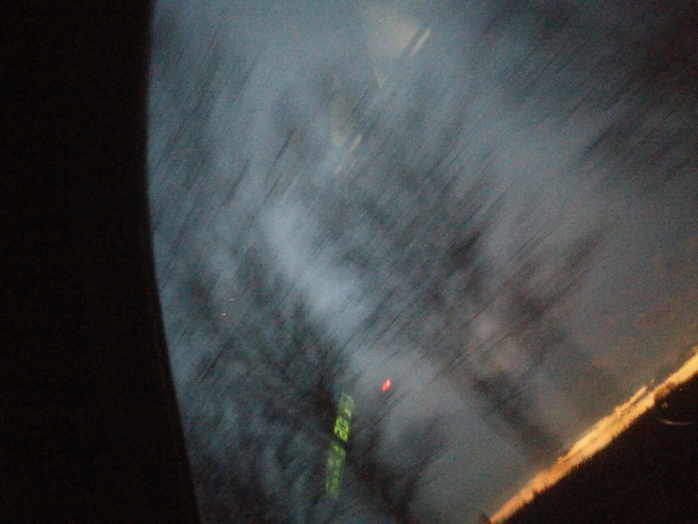
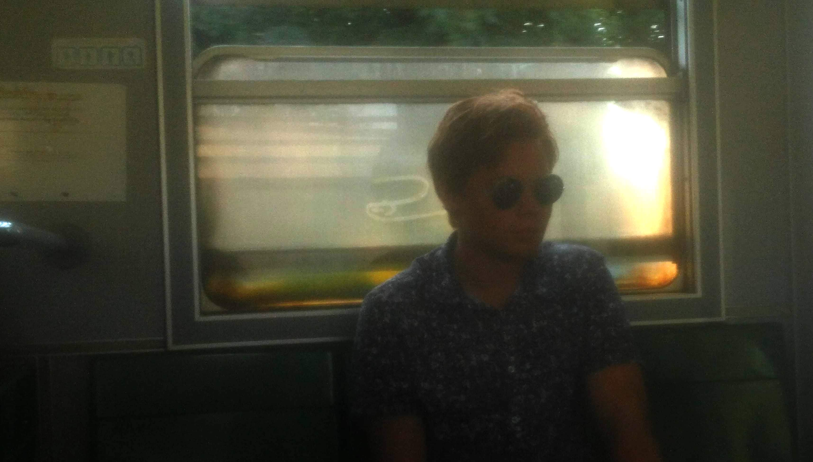
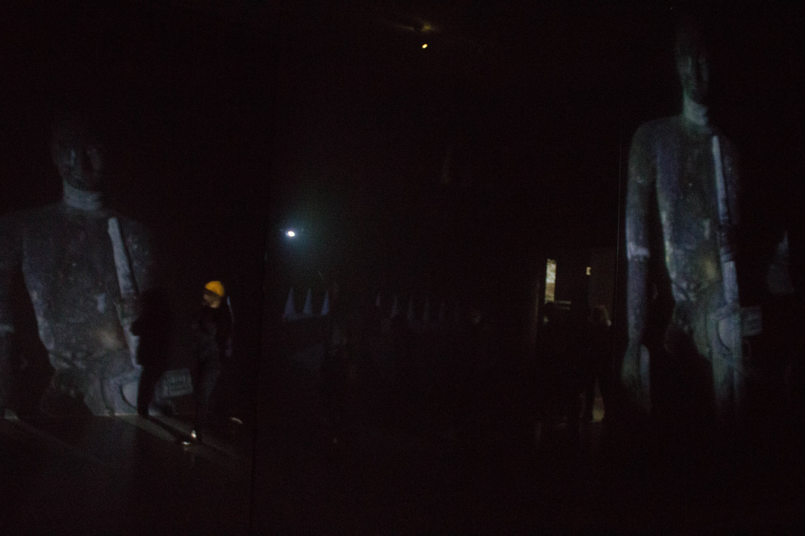

import Gallery from '../../components/gallery.jsx';
import Embed from '../../components/embed.jsx';
import Container from '../../components/container.jsx';

import img1 from '../../static/img/work/photogaphy/Analog Photos/analog-photo-16.jpg';
import img2 from '../../static/img/work/photogaphy/Analog Photos/analog-photo-18.jpg';
import img3 from '../../static/img/work/photogaphy/Analog Photos/analog-photo-10.jpg';
import img4 from '../../static/img/work/photogaphy/Analog Photos/analog-photo-20.jpg';
import img5 from '../../static/img/work/photogaphy/Analog Photos/analog-photo-6.jpg';
import img6 from '../../static/img/work/photogaphy/Analog Photos/analog-photo-8.jpg';
import img7 from '../../static/img/work/photogaphy/Analog Photos/analog-photo-24.jpg';
import img8 from '../../static/img/work/photogaphy/Analog Photos/analog-photo.jpg';
import img9 from '../../static/img/work/photogaphy/Analog Photos/analog-photo-2.jpg';

<Gallery width={50}>

</Gallery>

<Container>

## Intentionally Uncontrolled
This experimentational and inventive way of thinking became something that influenced my image making strongly. Even when I have more control.

</Container>
<Gallery width={35}>

</Gallery>
<Gallery width={33}>
    
    
    
    
    
    
    
</Gallery>

