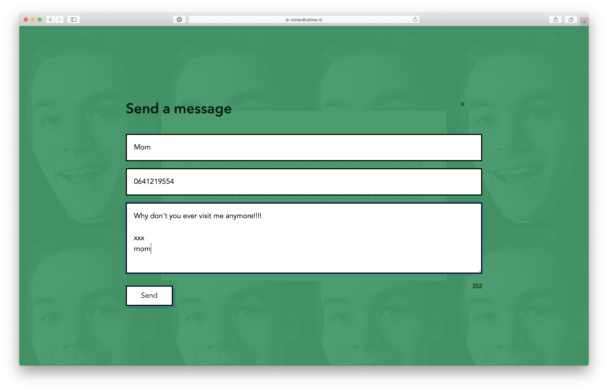
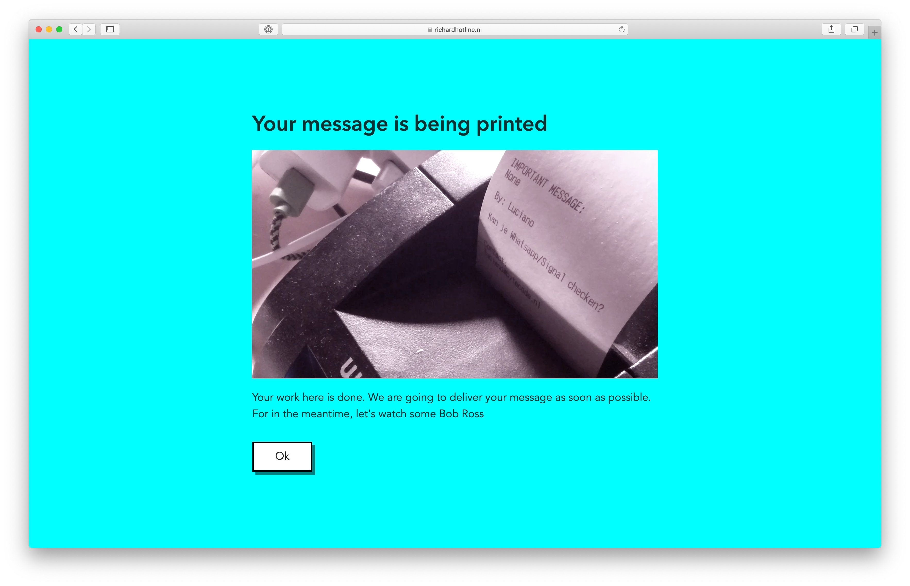
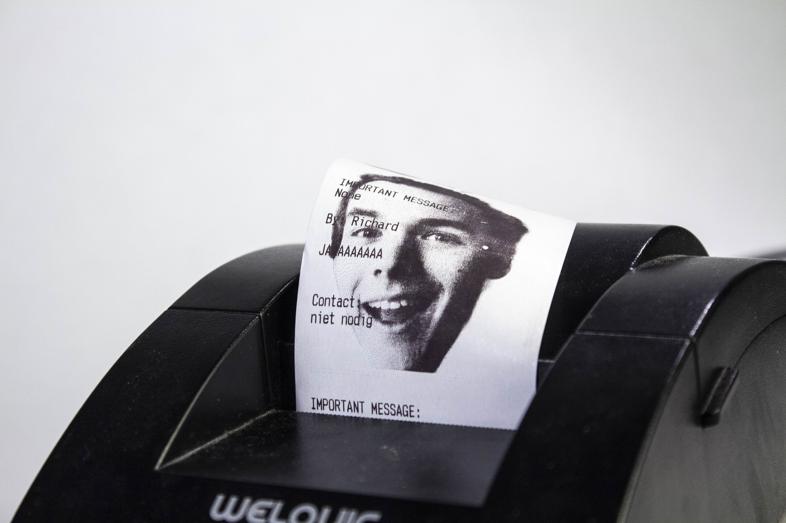
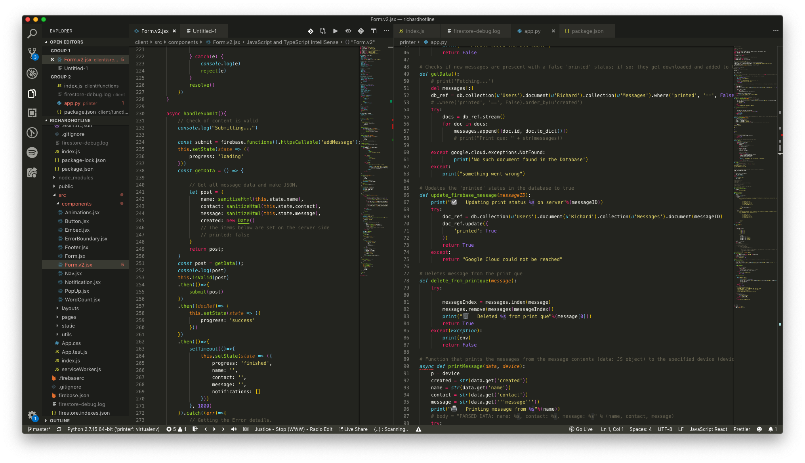

import Gallery from '../../components/gallery.jsx';
import Embed from '../../components/embed.jsx';

<<<<<<< HEAD
import image1 from '../../static/img/work/richardhotline/code.png';
import image2 from '../../static/img/work/richardhotline/compose-window.png';
import image3 from '../../static/img/work/richardhotline/end-screen.png';
import image5 from '../../static/img/work/richardhotline/richardhotline-2.jpg';
import image6 from '../../static/img/work/richardhotline/richardhotline-3.jpg';
import image7 from '../../static/img/work/richardhotline/code.png';
import image8 from '../../static/img/work/richardhotline/start-screen.png';
=======
>>>>>>> feature/cms

<Gallery width={50}>

</Gallery>
<Gallery>

</Gallery>

